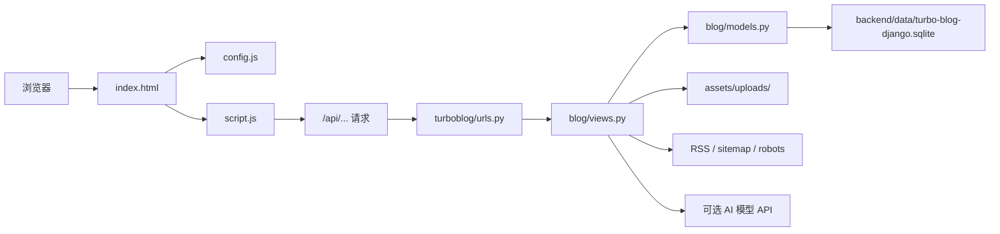

# Turbo Blog 项目学习与上线指南

整理日期：2026-05-06  
项目定位：一个轻量个人博客。Django 像发动机，负责数据、接口、登录、评论、上传、RSS 和 sitemap；原生 HTML/CSS/JS 像驾驶舱，负责页面、写作后台和交互。

## 1. 项目总览表

| 模块 | 作用 | 关键文件 | 你需要记住的一句话 |
| --- | --- | --- | --- |
| 前端入口 | 浏览器打开的第一张纸 | `index.html` | 只挂载 `#app`，再加载 `config.js` 和 `script.js`。 |
| 前端配置 | 决定 API 请求打到哪里 | `config.js` | 同域部署时留空；前后端分开时填后端公网地址。 |
| 前端逻辑 | 页面渲染、路由、写作、评论、AI 问答 | `script.js` | 所有前端“大脑”都在这里。 |
| 前端样式 | 颜色、布局、响应式、卡片、表单 | `styles.css` | 页面长相基本都改这里。 |
| 站点图片 | 头像、上传图、分享图 | `assets/` | 固定头像在根图片，后台上传图在 `assets/uploads/`。 |
| Django 配置 | 环境变量、数据库、上传目录、AI 配置 | `turboblog/settings.py` | 项目的总电闸。 |
| Django 路由 | URL 到函数的分发 | `turboblog/urls.py` | 看到接口地址，先来这里找对应函数。 |
| 数据模型 | 数据库表结构 | `blog/models.py` | 文章、评论、用户、会话、验证码都在这里定义。 |
| 业务接口 | API、RSS、sitemap、静态页面服务 | `blog/views.py` | 后端主战场，绝大多数行为都在这里。 |
| 跨域处理 | CORS 和 OPTIONS | `blog/middleware.py` | 允许前端跨域调用后端。 |
| 初始化数据 | 从旧 JSON 导入站点与文章 | `blog/management/commands/seed_initial_data.py` | 空库第一次启动时喂一点内容。 |
| 默认数据库 | SQLite 数据文件 | `backend/data/turbo-blog-django.sqlite` | 本地真实数据在这里。 |
| 旧数据种子 | 初始文章、站点信息 | `backend/data/db.json` | 只影响首次导入或重建库。 |
| 启动脚本 | Windows 本地启动/停止 | `start-blog.bat`、`stop-blog.bat` | 双击即可本地跑起来。 |
| 部署配置 | 云平台启动命令 | `Procfile` | Heroku/Railway 类平台会读它。 |
| 测试脚本 | 后端冒烟检查 | `scripts/test_django_backend.py` | 改完后跑它，像出门前检查钥匙。 |

当前本地数据库概况：站点名 `Turbo Blog`，公网地址仍是 `http://localhost:5173`，共有 4 篇文章，4 篇已发布文章，1 条评论，0 条待审评论。

## 2. 架构图



这不是 React/Vue 项目，而是“原生前端 + Django 单体后端”。浏览器加载静态文件，`script.js` 用 `fetch()` 调 Django API；Django 再读写 SQLite，必要时保存上传图片。

## 3. 要改内容时去哪里

| 你想改什么 | 去哪个文件 | 具体位置/关键词 |
| --- | --- | --- |
| 浏览器标题、SEO 描述、分享图 | `index.html` | `<title>`、`meta name="description"`、`og:*` |
| API 后端地址 | `config.js` | `window.TURBO_BLOG_CONFIG.apiBase` |
| 首页大标题和介绍文案 | `script.js` | `hero()` |
| 顶部导航、底部版权 | `script.js` | `layout()` |
| AI 小助手区域文案 | `script.js` | `aiAssistantPanel()` |
| 首页文章列表、筛选、短札、关于 | `script.js` | `renderHome()` |
| 文章详情页 | `script.js` | `renderPost()` |
| 写作后台表单 | `script.js` | `renderEditor()` |
| 管理员登录弹窗 | `script.js` | `adminLoginModal()` |
| 前端按钮点击、提交表单、上传图片 | `script.js` | `bindEvents()` |
| 前端 Markdown 渲染规则 | `script.js` | `markdownToHtml()`、`renderInlineMarkdown()` |
| 颜色、字体、间距、移动端布局 | `styles.css` | `:root`、对应 class、`@media` |
| 头像/站点图标 | `assets/avatar-blue-anime.png` | 替换同名图片最省事 |
| 上传图片存储位置 | `assets/uploads/` | 后台上传后自动写入 |
| API 路由增删 | `turboblog/urls.py` | `urlpatterns` |
| 文章字段、评论字段、用户字段 | `blog/models.py` | `Post`、`Comment`、`BlogUser` 等模型 |
| 文章增删改查逻辑 | `blog/views.py` | `posts()`、`post_detail()` |
| 评论提交和审核逻辑 | `blog/views.py` | `post_comments()`、`admin_comments()`、`admin_comment_detail()` |
| 验证码、限流、敏感词 | `blog/views.py`、`turboblog/settings.py` | `captcha()`、`is_rate_limited()`、`SENSITIVE_WORDS` |
| 图片上传大小和格式 | `blog/views.py`、`turboblog/settings.py` | `upload_image()`、`IMAGE_UPLOAD_LIMIT` |
| AI 检索和 RAG 逻辑 | `blog/views.py`、`turboblog/settings.py` | `ai_ask()`、`best_post_passages()`、`call_rag_model()` |
| SQLite 文件位置 | `turboblog/settings.py` | `SQLITE_FILE` |
| 生产环境密钥、域名、Debug | `turboblog/settings.py` | 环境变量读取区 |
| 初始文章内容 | `backend/data/db.json` | 只在空库导入时生效 |
| 初始化导入规则 | `blog/management/commands/seed_initial_data.py` | `handle()` |
| 本地启动逻辑 | `start-blog.bat` | 端口、迁移、启动命令 |
| 停止本地服务 | `stop-blog.bat` | 端口 `4000,5173,8000` |
| 云平台启动命令 | `Procfile` | `web:` 后面的命令 |

注意：站点标题、描述、公网地址已经存进 SQLite 后，改 `backend/data/db.json` 不会自动覆盖旧库。已有库要改 `public_url`，可用：

```bash
python manage.py shell -c "from blog.models import SiteSetting; s=SiteSetting.objects.get(pk=1); s.public_url='https://你的域名'; s.save()"
```

## 4. 数据模型速记

| 模型 | 数据库里的角色 | 关键字段 |
| --- | --- | --- |
| `SiteSetting` | 站点设置 | `title`、`description`、`public_url` |
| `BlogUser` | 管理员/作者账号 | `username`、`password_hash`、`role` |
| `Session` | 登录会话 | `token_hash`、`expires_at`、`revoked_at` |
| `Post` | 博客文章 | `title`、`slug`、`excerpt`、`content`、`tags`、`status` |
| `Comment` | 评论 | `post`、`author`、`content`、`approved`、`status` |
| `Captcha` | 评论验证码 | `answer_hash`、`expires_at`、`used`、`failures` |
| `RateLimit` | 评论频率限制 | `key`、`count`、`expires_at` |

最重要的关系：一篇 `Post` 可以有多条 `Comment`；评论默认 `pending`，管理员通过后才公开展示。

## 5. API 地图

| 接口 | 方法 | 用途 | 是否需要管理员 |
| --- | --- | --- | --- |
| `/api/health` | GET | 健康检查 | 否 |
| `/api/storage` | GET | 查看存储状态 | 否 |
| `/api/site` | GET | 获取站点信息 | 否 |
| `/api/posts` | GET | 文章列表、搜索 | 否；带草稿需登录 |
| `/api/posts` | POST | 新建文章 | 是 |
| `/api/posts/<slug或id>` | GET | 文章详情 | 否；草稿需登录 |
| `/api/posts/<slug或id>` | PUT/DELETE | 修改/删除文章 | 是 |
| `/api/posts/<slug或id>/comments` | POST | 提交评论 | 否 |
| `/api/captcha` | GET | 获取评论验证码 | 否 |
| `/api/admin/comments` | GET | 待审/已审评论列表 | 是 |
| `/api/admin/comments/<id>` | PUT/DELETE | 审核或删除评论 | 是 |
| `/api/uploads` | POST | 上传图片 | 是 |
| `/api/auth/login` | POST | 管理员登录 | 否 |
| `/api/auth/me` | GET | 检查登录状态 | 否 |
| `/api/auth/logout` | POST | 退出登录 | 是/有 token 更完整 |
| `/api/ai/ask` | POST | 博客知识问答 | 否 |
| `/sitemap.xml` | GET | 搜索引擎站点地图 | 否 |
| `/rss.xml` | GET | RSS 订阅 | 否 |
| `/robots.txt` | GET | 爬虫规则 | 否 |

## 6. 核心流程

### 6.1 打开首页

浏览器访问 `/`，Django 的 `frontend()` 返回 `index.html`；`script.js` 先 `loadSite()`，再 `navigate()`，最后 `loadPosts()` 拉文章并 `renderHome()` 画出首页。

### 6.2 写文章

点击“写作”后，前端先调用 `/api/auth/me` 检查管理员。登录通过后进入 `renderEditor()`；保存时提交到 `/api/posts` 或 `/api/posts/<id>`，Django 写入 `Post` 表。

### 6.3 评论

文章详情页先拉 `/api/captcha`。访客提交评论时，后端检查验证码、敏感词和频率限制；评论进入 `pending`，管理员在写作后台通过后才展示。

### 6.4 图片上传

写作后台选择图片，前端转成 base64 发到 `/api/uploads`；后端校验格式和大小，然后写入 `assets/uploads/`，返回 Markdown 图片地址。

### 6.5 AI 问答

问题进入 `/api/ai/ask`。后端把问题分词，在已发布文章里找相关片段；没有 `AI_API_KEY` 时用本地检索回答，有 key 时把片段交给 DeepSeek/OpenAI-compatible 模型生成回答。

## 7. 本地开发命令

Windows 推荐：

```bat
start-blog.bat
```

手动启动：

```bash
python -m pip install -r requirements.txt
python manage.py migrate --noinput
python manage.py seed_initial_data
python manage.py runserver [::]:5173
```

检查：

```bash
python manage.py check
python scripts/test_django_backend.py
```

本地地址：

```text
http://localhost:5173
http://localhost:5173/api/health
http://localhost:5173/sitemap.xml
```

本地默认管理员令牌/密码：`dev-token`。上线必须改。

## 8. 生产环境变量

| 变量 | 生产建议 | 作用 |
| --- | --- | --- |
| `DJANGO_SECRET_KEY` | 必填，长随机字符串 | Django 加密密钥 |
| `DJANGO_DEBUG` | `0` | 关闭调试模式 |
| `ALLOWED_HOSTS` | `你的域名,www.你的域名` | 允许访问的域名 |
| `ADMIN_TOKEN` | 强随机令牌 | 后台令牌登录 |
| `ADMIN_PASSWORD` | 强密码 | 管理员用户名密码登录 |
| `SQLITE_FILE` | 持久磁盘路径 | SQLite 数据库位置 |
| `JSON_BODY_LIMIT` | 默认即可 | JSON 请求体大小 |
| `IMAGE_UPLOAD_LIMIT` | 默认 5MB | 上传图片大小 |
| `SENSITIVE_WORDS` | 按需加词 | 评论敏感词 |
| `AI_PROVIDER` | `local`/`deepseek`/`openai` | AI 提供方 |
| `AI_API_KEY` | 有模型才填 | 模型 API Key |
| `AI_MODEL` | 如 `deepseek-chat` | 模型名称 |

## 9. 中国国内公网可见的上线流程

先分清两句话：

- “国内能打开”：技术问题，关键是服务器、域名、HTTPS、带宽。
- “长期稳定合规”：还要处理 ICP 备案、公安联网备案、页脚备案号。

### 9.1 推荐路线：国内云服务器 + 域名 + 备案

适合长期放博客，国内访问最稳。

1. 注册域名，并完成域名实名认证。
2. 购买中国内地云服务器，例如阿里云、腾讯云、华为云等；系统建议 Ubuntu LTS。
3. 在云厂商控制台提交 ICP 备案。工信部材料说明里要求在开通网站前通过接入服务商提交备案信息；地方通信管理局指南也说明境内提供非经营性互联网信息服务的组织或个人需要备案。
4. 备案通过后，把域名 DNS 解析到服务器公网 IP。
5. 服务器安装 Python 3.11+、Git、Nginx。
6. 上传代码，安装依赖，执行迁移和种子导入。
7. 用 Gunicorn 跑 Django，用 Nginx 反向代理到 Gunicorn。
8. 配 HTTPS 证书。
9. 修改站点 `public_url` 为你的域名，保证 RSS 和 sitemap 输出正确链接。
10. 在页脚展示 ICP 备案号；如果完成公安联网备案，也展示公安备案号。
11. 上线后确认 `/sitemap.xml`、`/rss.xml`、`/robots.txt` 都能访问。
12. 到百度搜索资源平台提交 sitemap，帮助百度更快发现页面。

参考启动命令：

```bash
python -m venv .venv
.venv/bin/pip install -r requirements.txt
DJANGO_DEBUG=0 ALLOWED_HOSTS=你的域名 ADMIN_TOKEN=强令牌 .venv/bin/python manage.py migrate --noinput
DJANGO_DEBUG=0 ALLOWED_HOSTS=你的域名 ADMIN_TOKEN=强令牌 .venv/bin/python manage.py seed_initial_data
DJANGO_DEBUG=0 ALLOWED_HOSTS=你的域名 ADMIN_TOKEN=强令牌 .venv/bin/gunicorn turboblog.wsgi:application --bind 127.0.0.1:8000
```

Nginx 反向代理示例：

```nginx
server {
    listen 80;
    server_name example.com www.example.com;
    client_max_body_size 8m;

    location / {
        proxy_pass http://127.0.0.1:8000;
        proxy_set_header Host $host;
        proxy_set_header X-Real-IP $remote_addr;
        proxy_set_header X-Forwarded-For $proxy_add_x_forwarded_for;
        proxy_set_header X-Forwarded-Proto $scheme;
    }
}
```

### 9.2 快速路线：中国香港/境外服务器

适合先让国内朋友能打开看看，省掉工信部 ICP 流程，但国内访问速度和稳定性不如内地服务器，也不保证所有网络环境都顺滑。阿里云文档明确区分：域名指向中国内地服务器需要备案，指向非中国内地服务器不需要工信备案；但长期面向国内，仍建议走内地备案路线。

### 9.3 备案与评论功能的提醒

这个项目带访客评论，属于交互内容。备案或后续核查时，不同地区、不同接入商对互动功能的审核口径可能不一样。稳妥做法是：先以只读博客备案上线，确认规则后再打开评论；或保留评论审核、敏感词和限流，避免直接公开未审核内容。

### 9.4 公安联网备案

《计算机信息网络国际联网安全保护管理办法》写明，网络正式联通后 30 日内，应到所在地公安机关指定受理机关办理备案手续。实际操作通常在全国互联网安全管理服务平台提交。完成后把公安备案号放到页脚。

要改页脚备案号：去 `script.js` 的 `layout()`，把 footer 里的版权文字改成类似：

```html
<span>© 2026 Turbo Blog · 粤ICP备xxxxxxxx号 · 粤公网安备xxxxxxxx号</span>
```

## 10. 上线前检查清单

| 检查项 | 目标 |
| --- | --- |
| `DJANGO_DEBUG=0` | 不暴露调试信息 |
| `DJANGO_SECRET_KEY` 已更换 | 不用本地默认密钥 |
| `ADMIN_TOKEN`/`ADMIN_PASSWORD` 已更换 | 不用 `dev-token` |
| `ALLOWED_HOSTS` 是真实域名 | 不长期使用 `*` |
| `SQLITE_FILE` 在持久磁盘 | 重启/重建不丢文章 |
| `assets/uploads/` 可持久保存 | 上传图片不丢 |
| 已备份 SQLite | 至少定期备份数据库文件 |
| `SiteSetting.public_url` 是 HTTPS 域名 | sitemap/RSS 链接正确 |
| `/sitemap.xml` 可访问 | 搜索引擎可发现文章 |
| `/robots.txt` 可访问 | 爬虫规则正常 |
| 页脚有 ICP/公安备案号 | 国内长期运行需要 |
| 评论审核开启 | 访客评论不直接公开 |
| `python scripts/test_django_backend.py` 通过 | 核心接口没坏 |

## 11. 快速学习路线

按这个顺序学，像从地图边缘走到城市中心：

1. 先跑起来：用 `start-blog.bat` 打开 `http://localhost:5173`，写一篇测试文章。
2. 看入口：读 `index.html`，知道页面如何加载 JS/CSS。
3. 看前端状态：读 `script.js` 顶部的 `state`，它就是页面记忆。
4. 看请求封装：读 `apiBase()`、`request()`、`apiHeaders()`，理解前端怎样带 token 调接口。
5. 看页面渲染：读 `renderHome()`、`renderPost()`、`renderEditor()`，它们把数据变 HTML。
6. 看事件系统：读 `bindEvents()`，所有点击、输入、提交都在这里被接住。
7. 看路由：读 `navigate()`，理解 `/`、`/post/...`、`/editor/...` 怎么切页面。
8. 看 Django 路由：读 `turboblog/urls.py`，把 API 地址和视图函数连起来。
9. 看业务接口：读 `blog/views.py`，重点看文章、评论、上传、AI 四组函数。
10. 看数据表：读 `blog/models.py`，再对照 API 返回的数据。
11. 看配置：读 `turboblog/settings.py`，把环境变量、SQLite、上传目录、AI 配置看懂。
12. 看测试：读 `scripts/test_django_backend.py`，它是项目“应该怎样工作”的简版说明书。

练手建议：

| 练习 | 修改文件 | 收获 |
| --- | --- | --- |
| 把首页标题改成自己的话 | `script.js` 的 `hero()` | 熟悉渲染函数 |
| 改主题色 | `styles.css` 的 `:root` | 熟悉样式变量 |
| 新增一个文章标签筛选 | `script.js` 的 `categoryOf()` 和 `renderHome()` | 熟悉前端状态和筛选 |
| 给文章加字段 | `blog/models.py`、迁移、`blog/views.py`、`script.js` | 走完整前后端链路 |
| 改 AI 提示词 | `blog/views.py` 的 `rag_messages()` | 理解 RAG 边界 |
| 加一个新 API | `turboblog/urls.py` + `blog/views.py` | 理解 Django 路由 |

## 12. 资料来源

- 工信部《非经营性互联网信息服务备案》：https://www.miit.gov.cn/jgsj/xgj/bszn/art/2008/art_0740df6dde6e4d1fb6626066f4787c33.html
- 云南省通信管理局《非经营性互联网信息服务备案程序》：https://ynca.miit.gov.cn/bsfw/bszn/art/2020/art_1e2c69c668b74b59b2572d2a8138b454.html
- 阿里云 ICP 备案流程 FAQ： https://help.aliyun.com/zh/icp-filing/basic-icp-service/support/for-the-record-process-faq
- 中央网信办《计算机信息网络国际联网安全保护管理办法》：https://www.cac.gov.cn/2014-10/08/c_1112737294.htm
- 百度搜索资源平台 Sitemap 工具：https://ziyuan.baidu.com/wiki/44
